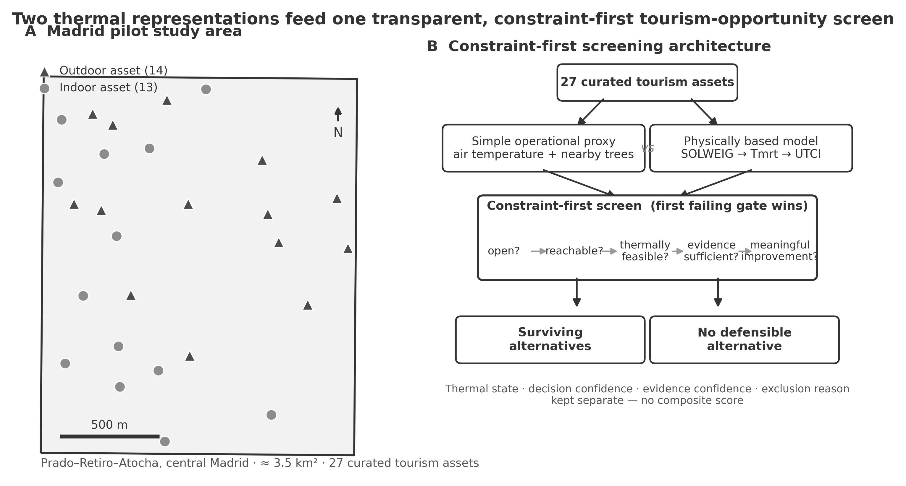
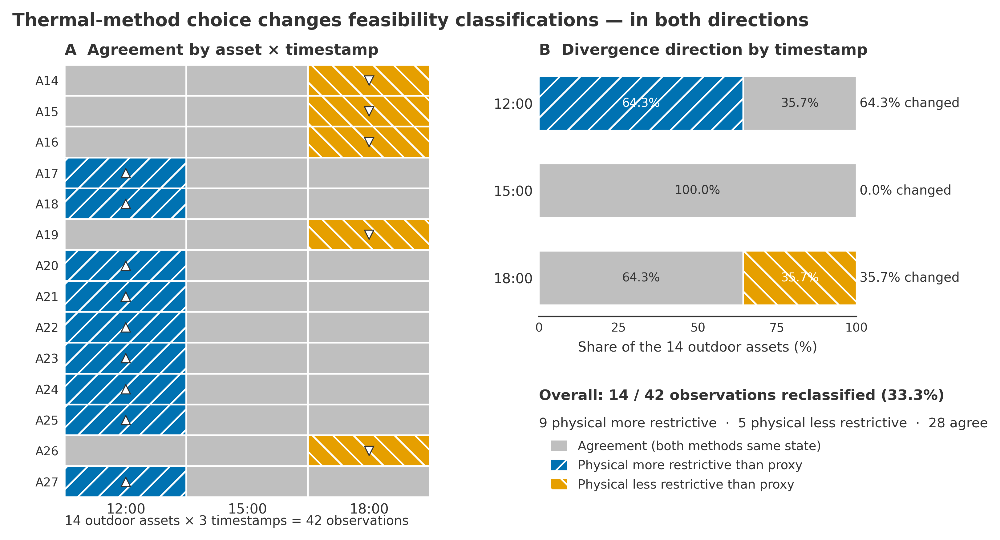
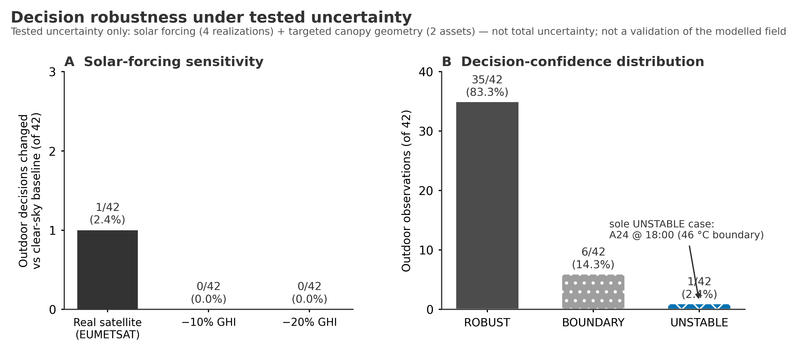

# HATI-Madrid

**Heat-adaptive urban tourism opportunity screening through transparent, constraint-first decision support.**

HATI-Madrid is a reproducible research pilot examining how the *thermal method* used to
operationalise heat can change time-specific tourism-feasibility classification and the
construction of a candidate set of tourism opportunities. On a single documented extreme-heat
day in central Madrid, it compares two alternative thermal-method operationalisations — a
simple operational proxy and a physically based SOLWEIG/UTCI configuration — inside one
transparent, constraint-first screening architecture that keeps thermal state, evidence, and
uncertainty auditable rather than collapsed into a single score.


[](https://doi.org/10.5281/zenodo.22707470)

**See [PROJECT_STATUS.md](PROJECT_STATUS.md) for the canonical status record.** The
original HATI-Madrid pilot described below is `RELEASE_LOCKED` (as of 2026-09-14):
current reference commit/DOI, what is demonstrated vs. model-derived/unvalidated, the
claim ceiling, and allowed maintenance changes. Since that lock, a separate bounded
research extension (`docs/research/pedestrian-heat/`) completed a bounded research
sequence through Gate 3B, concluding `ABSTAIN / NO ROBUST DIFFERENCE` — evidence was
insufficient to declare either route robustly superior. That extension is now
`RESEARCH_FROZEN_AFTER_GATE_3B`: the sequence is deliberately frozen rather than
extended indefinitely, not abandoned or unfinished. See PROJECT_STATUS.md §B for its
status and narrow reopening conditions; it does not revise this locked pilot.
PROJECT_STATUS.md also records the disposition of every issue and pull request across
both. A concise professional summary of this work is available in
[`portfolio/HATI_CASE_STUDY.md`](portfolio/HATI_CASE_STUDY.md).

> **Status — public research repository · public preprint.** The current academic
> dissemination route is a **non-peer-reviewed preprint / research work for public archival
> dissemination**. The preprint is publicly available on
> **[ResearchGate](https://www.researchgate.net/publication/414226835_Thermal_representation_as_a_decision_variable_in_heat-adaptive_tourism_opportunity_screening_evidence_from_a_Madrid_pilot)**
> and archived on **[Zenodo](https://doi.org/10.5281/zenodo.22707470)**
> (DOI [10.5281/zenodo.22707470](https://doi.org/10.5281/zenodo.22707470); concept DOI
> [10.5281/zenodo.22707469](https://doi.org/10.5281/zenodo.22707469) always resolves to the
> latest archived version). No future journal route has been selected, and the work is **not an
> operational or real-time tourism product**. The figures and findings shown below are
> **descriptive** results of a single Madrid pilot; several thermal outputs are **model-derived**
> (see *What the project does not claim*).

---

## Project at a glance

| | |
|---|---|
| **Study area** | Prado–Retiro–Atocha, central Madrid |
| **Spatial scope** | ≈ 3.5 km² bounded pilot |
| **Study day** | 21 August 2023 (AEMET-designated extreme-heat episode) · 12:00 / 15:00 / 18:00 |
| **Tourism assets** | 27 curated (13 indoor, 14 outdoor) |
| **Outdoor thermal comparison** | 14 outdoor assets × 3 timestamps = 42 observations |
| **Scenario experiments** | 8 pre-registered decision scenarios |
| **Thermal methods compared** | operational proxy **vs** SOLWEIG → Tmrt → UTCI configuration |
| **Decision architecture** | constraint-first, first-failing-gate screening (no composite score) |
| **Research status** | Public preprint; not peer reviewed |
| **Current dissemination target** | Public archival dissemination |
| **Repository visibility** | public research repository |

---

## Research question

When heat becomes operationally important for urban tourism, **which currently available
tourism opportunities remain defensible candidates for consideration at a particular time?**
This upstream candidate-eligibility decision precedes any routing, ranking, or visitor-facing
recommendation. The study addresses three linked questions:

- **RQ1 — thermal-method sensitivity.** Do alternative thermal-method operationalisations
  (proxy vs SOLWEIG/UTCI, each with its own decision-category mapping) yield different
  tourism-feasibility classifications, and are the differences interpretable in terms of the
  underlying thermal representation?
- **RQ2 — candidate eligibility.** How does constraint-first screening alter candidate
  eligibility relative to a proximity-only nearest-open heuristic, and can it preserve an
  explicit no-survivor state when no candidate satisfies the constraints?
- **RQ3 — robustness and traceability.** Do those decisions stay auditable and stable under
  the tested uncertainty?

---

## Why this project exists

Existing work tends to address three decision levels separately: **broad climate-suitability
assessment** (coarse, destination/season scale), **thermal routing / accessibility** (which
takes origin–destination or a destination set as given), and **urban thermal mapping**. The
closest identified approaches operate downstream of, or at a coarser scale than, the
opportunity-screening step. HATI-Madrid examines how thermal eligibility, operational
constraints, evidence sufficiency, and uncertainty can be made explicit at the
**tourism-opportunity screening stage** — the point at which the candidate set is produced and
filtered. This is a bounded pilot demonstration, not a claim that no prior work exists.

---

## Conceptual workflow

```
                         Urban tourism opportunities
                                    │
                  ┌─────────────────┴──────────────────┐
        Simple operational proxy            Physically based configuration
   air-temperature hazard + nearby              SOLWEIG → Tmrt → UTCI
        tree-presence information
                  └─────────────────┬──────────────────┘
              (alternative thermal-method operationalisations)
                                    │
                     Time-specific feasibility classification
                                    │
                          Constraint-first screening
              open? → reachable? → thermally feasible? →
                 evidence sufficient? → meaningful improvement?
                                    │
                            Surviving candidate set
                                    │
                  ┌─────────────────┴──────────────────┐
             Surviving alternatives          No defensible alternative
```

The two thermal paths are **alternative operationalisations of equal standing** — neither is
treated as a corrected or superior version of the other.

---

## Eligibility before ranking

The organising principle of HATI-Madrid is that a recommendation should not begin by asking
*"which option scores highest?"* but *"which options are even admissible under the constraints?"*

```
        Raw candidate universe (all curated assets)
                        │
              hard eligibility constraints
        open? → reachable? → thermally feasible? →
           evidence sufficient? → improvement?
                        │
              Surviving candidate set
                        │
           ranking / comparison — only among survivors
```

Ranking and eligibility are kept as **separate stages**, not folded into one composite score. A
high-scoring candidate is irrelevant if it violates a hard constraint, so screening comes first;
only the survivors are eligible to be compared or ranked at all. Two consequences follow directly
and are visible in this pilot:

- The **first failing gate wins** and records one machine-readable exclusion reason, so every
  removal is traceable rather than absorbed into a weighting.
- When **no** candidate survives, the system returns an explicit `NO_DEFENSIBLE_ALTERNATIVE`
  state rather than forcing a least-bad recommendation (see scenario S8 below).

This section documents the existing screening architecture; it introduces no new weights, scores,
thresholds, or scenarios.

---

## Method

**Study area & assets.** A rectangular Prado–Retiro–Atocha pilot (≈ 3.5 km²) pinned to named
landmarks, with 27 curated tourism assets from OpenStreetMap (purposive, not a representative
sample).

**Operational proxy.** An ambient air-temperature hazard band (AEMET civil-protection warning
thresholds) combined with a nearby OpenStreetMap `natural=tree`-count exposure grade, mapped
through a first-matching-rule feasibility decision. This proxy is **not** land-surface
temperature, **not** measured shade, **not** canopy fraction, and **not** ground truth — it is
a deliberately simple open-data operational screen.

**Physically based configuration.** Mean radiant temperature (Tmrt) modelled with SOLWEIG at
2.5 m from LiDAR-derived geometry, combined with meteorological forcing to derive **model-derived
UTCI** (10 m buffer-mean), mapped to the same three feasibility states. UTCI here is a model
output, never observed comfort or validated truth.

**Constraint-first screening.** Each candidate passes an ordered sequence of hard constraints —
open at the timestamp? within reach? within the outdoor thermal limit (UTCI < 46 °C)? evidence
sufficient? a meaningful thermal improvement over the source? The **first failing gate wins**
and records one machine-readable exclusion reason. There is no weighted or composite score, and
thermal state, decision confidence, and evidence confidence are kept as separate fields.

**Uncertainty.** An evidence-derived envelope over the realizations actually computed (solar
forcing across all outdoor rows; targeted canopy geometry for two assets) yields a categorical
per-decision confidence class: **ROBUST / BOUNDARY / UNSTABLE**. *ROBUST* means stable under the
tested uncertainty dimensions — **not** accurate, certain, or validated.

---

## Key findings

*All values are descriptive results of the pilot (asset × timestamp observations and scenario
comparisons); no inferential/population statistics are applied.*

**Thermal-method sensitivity.** Switching the thermal method reclassified **14 / 42 = 33.3%** of
outdoor asset-time classifications — **9** where the physically based configuration was more
restrictive than the proxy and **5** where it was less restrictive.

> **Important interpretive fact.** Under the physically based categorical configuration, **all
> 42 outdoor observations fell into `FEASIBLE WITH CONDITIONS`** (UTCI 32–46 °C). The divergence
> therefore reflects the proxy's three-state banding relative to that single physical category —
> it does **not** show that the physical method corrected proxy "errors" or supplied a richer
> categorical decision signal. The result is sensitivity to the end-to-end thermal-method
> operationalisation, not evidence of physical-method superiority.

**Timestamp pattern (descriptive).** Divergence was time-concentrated: **12:00 = 64.3%**,
**15:00 = 0.0%**, **18:00 = 35.7%**.

**Opportunity screening.** Relative to a **proximity-only nearest-open** heuristic, the
constraint-first candidate set changed in **7 of 8** scenarios. This is decision *consequence*
relative to a minimal proximity comparator — not algorithmic superiority over other heat-aware
systems.

**Baseline behaviour.** The proximity-only nearest-open pick failed the locked screening in
**3 of 8** scenarios (each `OUTDOOR_EXPOSURE_TOO_HIGH`); across all scenarios, 23 open,
in-radius options were removed on thermal/evidence grounds.

**Explicit no-survivor state (constraint-contingent).** In scenario S8 (Parque del Retiro,
15:00, **500 m** reach), 26 candidates were evaluated and **0** survived, returning
`NO_DEFENSIBLE_ALTERNATIVE`. This is contingent on the reach: at **800 m** two alternatives were
available for the same source and hour, and **seven** at 1200 m. The no-survivor result thus
demonstrates the architecture *can* decline under a specified constraint set, not that no
alternative existed generally.

**Robustness (tested dimensions).** Under a satellite-derived irradiance realization, 1 / 42
decisions changed (2.4%); ±10% and ±20% irradiance perturbations changed none. Decision
confidence: **ROBUST 35/42, BOUNDARY 6/42, UNSTABLE 1/42** (the single UNSTABLE case, A24 at
18:00, sits at the 46 °C boundary).

---

## What the project does *not* claim

HATI-Madrid does **not** establish that:

- SOLWEIG/UTCI is ground truth for this pilot, or that the physical method is more accurate than
  the operational proxy;
- the physical method supplied a richer categorical decision signal (it did not, in this
  configuration);
- tourist behaviour changed, visitor flows were redistributed, or safety/health outcomes
  improved;
- any specific alternative is behaviourally optimal;
- the results automatically generalise to other destinations or days;
- `ROBUST` means fully validated (it means robust against the *tested* uncertainty dimensions).

---

## Publication figures

<p align="center">
  
</p>

*Figure 1 — Study design and screening architecture: the Madrid pilot area with 27 assets, and
the constraint-first pipeline in which two thermal methods feed one ordered gate chain.*

<p align="center">
  
</p>

*Figure 2 — Thermal-method divergence: agreement/direction matrix and timestamp summary. Cells
encode direction of divergence (physical more/less restrictive than the proxy), not correctness.*

<p align="center">
  
</p>

*Figure 3 — Screening consequence across eight scenarios versus a proximity-only nearest-open
baseline, with S8's constraint-contingent no-survivor state highlighted.*

<p align="center">
  
</p>

*Figure 4 — Decision robustness under tested uncertainty (solar-forcing sensitivity and the
confidence distribution); "tested uncertainty only", not a validation of the modelled field.*

A supplementary UTCI-field figure and the graphical abstract are in `outputs/publication/`.

---

## Repository structure

```
.
├── manuscript/         manuscript sections, assembled manuscript, tables, verified references
├── supplementary/      supplementary material (Figure S1, Tables S1–S4, reproducibility notes)
├── submission/         historical submission inventory and preprint release package
├── outputs/            locked result tables, SOLWEIG maps, and publication figures + render scripts
├── src/                analysis pipeline (study area, proxy, SOLWEIG runs, screening, validation)
├── scripts_assembly/   manuscript-assembly and reference-build scripts
├── app/                read-only Dash decision-support prototype (illustrative; not a result)
├── data/               open-data inputs (data/raw) and processed/derived data (data/processed)
├── tests/              reproducibility / integrity checks
└── docs/               method records, provenance, and the internal research/QA record
```

**Publication / reproducibility core:** `manuscript/`, `supplementary/`, `submission/`,
`outputs/`, `src/`, `scripts_assembly/`, `tests/`, and the provenance files in `docs/`.
**Internal research record:** the phase gates, audits, and reviewer notes in `docs/` are kept
versioned as a transparent audit trail. They are working research records rather than curated
public documentation, and are outside the bounded ResearchGate release package.

---

## Reproducibility

See **[REPRODUCIBILITY.md](REPRODUCIBILITY.md)** for the full workflow. In brief:

- **Two Python environments:** an analysis/figure environment (**Python 3.14**, pinned in
  [`requirements.txt`](requirements.txt)) and a dedicated **SOLWEIG environment** (**Python
  3.12**, `solweig==0.1.0b92` + `pvlib`), because the `solweig` package caps at
  `Requires-Python < 3.14`.
- **Inputs** are open data under `data/raw/`; each layer's provenance is documented (below).
- **Outputs** regenerate into `data/processed/`, `outputs/tables/`, `outputs/maps/`, and
  `outputs/publication/`. Figure scripts assert their headline numbers against the locked tables
  before saving.
- There is **no single one-command reproduction**; the pipeline runs as an ordered sequence of
  scripts across the two environments (documented in `REPRODUCIBILITY.md`).

---

## Data sources

All inputs are open data; third-party datasets retain their original licences. Full provenance:
`docs/DATA_SOURCE_INVENTORY.csv` and `docs/PHASE1_DATA_PROVENANCE.md`.

| Source | Role in the analysis | Licence / note |
|---|---|---|
| **AEMET** (Barajas station; Meteoalerta thresholds) | meteorological forcing; civil-protection hazard bands | Spanish open-data terms |
| **IGN/CNIG national LiDAR (PNOA)** | 3-D geometry (DEM, building & vegetation height) for SOLWEIG | CC-BY 4.0 / IGN terms |
| **OpenStreetMap** | tourism assets, `natural=tree` points, park/garden polygons, opening-hours tags | ODbL |
| **Madrid open data — Arbolado** | per-tree heights for the targeted canopy-geometry recheck | Madrid open-data terms |
| **Copernicus HRL Tree Cover Density (2018)** | cross-read in the geometry-evidence audit | Copernicus licence (open) |
| **EUMETSAT CM SAF (satellite radiation)** | one satellite-derived irradiance realization for solar-forcing sensitivity | EUMETSAT terms |

Land-surface temperature and satellite thermal imagery were **not** used. No API key or
credential is stored in this repository.

---

## Evidence and traceability

Beyond code and data, the repository preserves the research provenance: pre-registration and
phase gates, parameter justification, an evidence matrix, an uncertainty audit, a reviewer
attack map, the figure render manifest with per-figure hashes, and Git scientific snapshots. The
annotated tag **`pre-targeted-revision-v0.2`** marks the preserved scientific checkpoint
immediately before the reviewer-driven revision, so revisions can be diffed exactly against it.
This supports **auditability** — it does not imply that Git history itself validates the science.

---

## Current status

- [x] Research feasibility
- [x] Operational-proxy evaluation
- [x] SOLWEIG/UTCI physical modelling
- [x] Uncertainty audit
- [x] Opportunity-screening experiments
- [x] Manuscript drafted and assembled
- [x] References verified (23 references)
- [x] Publication figures locked
- [x] Hostile four-reviewer audit
- [x] Targeted-revision record preserved locally; the named branch is not present on the remote
- [x] Public preprint release package prepared from the public canonical manuscript
- [x] Public preprint available on ResearchGate — verified link below
- [x] Zenodo archival upload — DOI [10.5281/zenodo.22707470](https://doi.org/10.5281/zenodo.22707470)
- [ ] Human review of author/affiliation metadata and final PDF
- [ ] Peer review

The metadata/PDF review above is a post-publication editorial check (e.g. confirming
affiliation/ORCID text if any is later added); it does **not** mean the Zenodo/ResearchGate
deposit itself is incomplete — both are already public, as recorded above.

Historical publication record: the manuscript was submitted on **2026-08-22** and received a
**desk rejection on 2026-08-23**. Those events are historical audit facts, not the current
dissemination route. The current route is public preprint archival dissemination: the preprint
is publicly available on
**[ResearchGate](https://www.researchgate.net/publication/414226835_Thermal_representation_as_a_decision_variable_in_heat-adaptive_tourism_opportunity_screening_evidence_from_a_Madrid_pilot)**
and archived on **[Zenodo](https://doi.org/10.5281/zenodo.22707470)** (see *Citation* below).

---

## Manuscript

**Canonical title:** *Thermal representation as a decision variable in heat-adaptive tourism
opportunity screening: evidence from a Madrid pilot*.

Manuscript sections, the assembled manuscript, editable tables, and the verified reference list
are in **[`manuscript/`](manuscript/)**. The public canonical source is
`manuscript/MANUSCRIPT_TMP_v0.2.md`; the bounded preprint package records the neutral
administrative transformations used for its release PDF. The release PDF is publicly available
on ResearchGate and archived on Zenodo (DOI [10.5281/zenodo.22707470](https://doi.org/10.5281/zenodo.22707470);
see *Citation* below).

---

## Software / tech stack

**Scientific analysis:** Python, NumPy, pandas, GeoPandas, Rasterio, rasterstats, Matplotlib,
and **SOLWEIG** (UMEP-dev standalone) for the physical thermal modelling; `pvlib` for the
clear-sky irradiance estimate.
**Research prototype (not a scientific contribution):** a read-only Dash/Plotly decision-support
prototype in `app/` that presents the locked outputs as an auditable interface.

---

## Limitations

- A single Madrid pilot; one documented extreme-heat day; 27 curated assets.
- No direct field validation of Tmrt/UTCI anywhere in the project.
- The uncertainty envelope covers the tested dimensions only (solar forcing + targeted geometry).
- Accessibility is straight-line reach, not route-level heat exposure.
- Opening hours documented in 2026 were applied retrospectively to the 2023 study day.
- No observed tourist behaviour, substitution, or outcome is measured.
- Indoor "refuge" is an assumed thermal-buffering state, not a physically measured condition.

These match the manuscript's Limitations section.

---

## Contributing

This is a public research repository, not a general-purpose software package. Research
collaboration and methodological discussion are welcome.

## Citation

See **[CITATION.cff](CITATION.cff)** and the bounded
**[ResearchGate metadata sheet](submission/researchgate/RESEARCHGATE_METADATA.md)**. The
non-peer-reviewed preprint is publicly available on
**[ResearchGate](https://www.researchgate.net/publication/414226835_Thermal_representation_as_a_decision_variable_in_heat-adaptive_tourism_opportunity_screening_evidence_from_a_Madrid_pilot)**
and archived on **[Zenodo](https://doi.org/10.5281/zenodo.22707470)**
(DOI: `10.5281/zenodo.22707470`; concept DOI `10.5281/zenodo.22707469` for the latest version).
No journal, volume, or issue has been assigned — **do not invent one**.

## Licence

**No repository-wide licence has yet been assigned.** Third-party datasets and software retain
their original licences. A repository licence is expected to be selected before formal submission;
until then, please treat the code and text as "all rights reserved" and contact the author before
reuse.

## Contact

Soroush Karahrodi — Madrid, Spain · tourism · territory · decision support ·
GitHub [@soroushkarahrodi79-oss](https://github.com/soroushkarahrodi79-oss)
