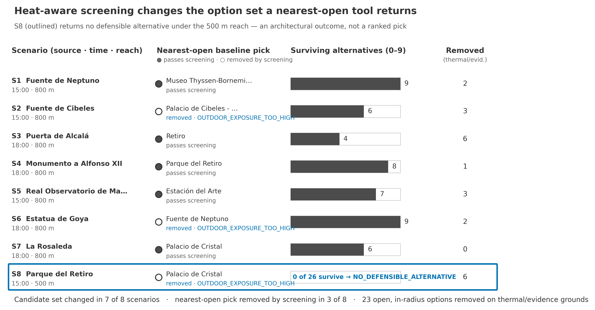

# Heat-aware tourism opportunity screening — a professional case study

*Built from the HATI-Madrid research pilot. The business scenario is **hypothetical**: no
company commissioned, tested or used this analysis.*

> **Status of the underlying research.** The original pilot is a public preprint that has
> not been peer reviewed (`RELEASE_LOCKED`, DOI
> [10.5281/zenodo.22707470](https://doi.org/10.5281/zenodo.22707470)). The separate
> pedestrian-route extension is `RESEARCH_FROZEN_AFTER_GATE_3B`, with the result
> **ABSTAIN / NO ROBUST DIFFERENCE**. All thermal values are **model outputs for 21 August
> 2023**. They are not measurements, and they do not describe current conditions in Madrid.

---

## 1. The business problem

Consider a company that runs guided walking tours in the Prado–Retiro–Atocha area. On
extreme-heat days it has to decide what to do when a scheduled outdoor stop, such as a
fountain, a monument or a garden, is likely to be very hot at the time the group reaches
it.

A common informal answer is "go to the nearest open place instead". That answer ignores
three things. The nearest place may be just as exposed. It may be closed at that hour.
And the evidence about how hot it is may be too weak to justify any change.

**The single decision examined in this case study:**

> *For a given outdoor tour stop at a given hour, is there a substitute stop, prepared
> before the season, that is open, within the group's straight-line distance limit, not
> modelled as hotter, and supported by sufficient evidence? Or is the defensible answer
> "no substitution recommended"?*

This is **opportunity screening**, meaning it decides which options are admissible. It
is **not route optimisation**, and it does not choose the "best" or "safest" route.

## 2. The research question behind it

HATI-Madrid asked an upstream question. On one documented extreme-heat day, which
tourism assets remain defensible candidates at a given time, and how much does that
answer depend on the method used to represent heat?

## 3. My role, and how this project was built

**What the repository records about my role:**

- I own the project and repository, and I am the sole named author of the archived
  preprint (`CITATION.cff`; the Zenodo record was owner-confirmed on 2026-09-14,
  `submission/researchgate/PUBLIC_TRUTH_AUDIT.md`).
- Pull requests enter `main` through my account. Twelve merge commits are mine, and so
  is the single commit whose title matches PR #5 (`PROJECT_STATUS.md` §7). Changes were
  therefore accepted by me before reaching `main`.
- I made recorded decisions at specific points. I approved AMENDMENT_001, the terrain
  source change, before any thermal output was inspected
  (`docs/research/pedestrian-heat/AMENDMENT_001.md`). I carried out the owner desk
  review of the scenario-replay prototype, with disposition `USEFUL / PROMOTE_TO_PR`,
  recorded as a bounded review and not a usability study (`docs/replay/DESK_REVIEW.md`).
  I confirmed the public ResearchGate and Zenodo records.

**Use of AI assistance (declared):** the code, documentation and analysis were produced
with substantial help from AI coding assistants. Of the repository's 52 commits:

- 27 are authored or co-authored by Anthropic's Claude.
- 13 carry my own account. Twelve of these are pull-request merges; one is a documentation
  commit.
- 12 were made under a generic project identity ("HATI-Madrid") with no co-author record.
  For these, the repository cannot tell who wrote the content.

One branch name (`codex/…`, PR #2) suggests that a second AI assistant was used for the
replay prototype; this was not verified. I did not personally write all of the code.

**What cannot be attributed from the repository:** the repository does not record, one
decision at a time, who first proposed each methodological choice. That includes the
research question, the gate order, the 32/46 °C decision thresholds, the 0.8 °C
improvement margin, the 800/500 m radii and the eight scenarios. This case study
therefore does not attribute the individual origin of those choices to myself, to an AI
assistant, or to any specific exchange between us. What is claimed above — ownership,
merge authority over every accepted change, and the specific dated decisions cited with
their sources — is what the repository's own records support. No broader claim of
personal authorship over the code or the method is made here, and none should be
inferred from the space this section otherwise leaves unattributed.

## 4. Data and processing

| Input | Source (licence) | Role |
|---|---|---|
| 27 tourism assets (13 indoor, 14 outdoor), opening-hours tags | OpenStreetMap (ODbL), plus institutional opening hours recorded in `src/phase3_build_catalog.py` | candidate set and the "open?" gate |
| Hourly meteorology, Madrid/Barajas, August 2023 | AEMET data relayed through Meteostat (see licence note in the pilot proposal) | hazard band and model forcing |
| 3-D geometry: terrain, buildings, vegetation height | IGN/CNIG PNOA LiDAR (CC BY 4.0) | SOLWEIG model input |
| Tree inventory, canopy density | Ayuntamiento de Madrid (CC BY 4.0), Copernicus HRL TCD 2018 | shade proxy and geometry checks |
| Tmrt and UTCI rasters at 12:00, 15:00 and 18:00 | **Model output** of SOLWEIG (GPL-3.0 software), committed in `outputs/maps/` | physical thermal method |

**Scope:** an area of about 3.5 km², one day (21 Aug 2023), and three **discrete**
hours: 12:00, 15:00 and 18:00. The analysis does not interpolate between those hours.

## 5. The method

Two ways of representing heat were compared for the 14 outdoor assets:

1. an **operational proxy**, combining the AEMET hazard band with an OpenStreetMap tree
   count; and
2. a **physically based** estimate: SOLWEIG mean radiant temperature converted to UTCI,
   averaged over a 10 m buffer around each asset.

Each candidate substitute then passes through ordered gates. The first gate it fails is
recorded as its only exclusion reason, and nothing is combined into a score:

```
open at that hour? → within straight-line distance limit? → below thermal limit (UTCI < 46 °C)?
→ evidence sufficient? → meaningful improvement over the original stop?
```

"Meaningful improvement" means one of three things: the substitute is indoors while the
source is outdoors; the substitute is at least 0.8 °C UTCI cooler or in a lower stress
category; or the substitute has a more stable decision while not being hotter. Eight
scenarios were then compared with a simple baseline, "nearest open option within the same
radius".

## 6. Verified results

Every number below was **re-executed from committed inputs and matched the locked tables**
(see [`REPRODUCTION_REPORT.md`](REPRODUCTION_REPORT.md)). They remain **model-derived**.



*Published figure FIG03, reused unmodified. Its script asserts 7/8, 3/8, 23 and S8
against the locked tables before rendering, and those assertions passed in the
reproduction.*

1. **The thermal method changed the answer.** 14 of 42 outdoor observations (33.3%)
   changed feasibility class between the two methods. The two methods agreed at 15:00
   and diverged at 12:00 (64.3%) and 18:00 (35.7%).
2. **The procedures disagreed.** In **3 of 8** scenarios (S2, S6, S8), the option picked
   by "nearest open" was excluded by the screening, because it was outdoors and modelled
   hotter than the stop it would replace.
3. **The candidate sets differed.** The screening removed at least one open, in-range
   candidate in 7 of 8 scenarios (23 removals in total).
4. **The method can say "no".** In S8 (Parque del Retiro, 15:00, 500 m straight-line
   radius) no substitute survived, so the output is `NO_DEFENSIBLE_ALTERNATIVE`.
5. **Stability is labelled.** Of the 42 outdoor decisions, 35 are ROBUST, 6 BOUNDARY and
   1 UNSTABLE under the tested perturbations.

## 7. Interpretation — what these results do and do not mean

- **3/8 shows that two selection procedures diverge under the study's rules.** It does
  not show that any real tour decision was wrong, that any risk was avoided, or that
  visitors would have been safer. The strength of the three cases also varies (§8).
- **7/8 mostly shows that the filters are active.** Adding constraints to a pool removes
  items almost by construction. It is context, not evidence of commercial superiority.
- **S8 shows the method's abstention state, not an operational recommendation.**
  `NO_DEFENSIBLE_ALTERNATIVE` means that, within the tested 500 m radius, no candidate
  substitute cleared every gate: the source park was already the coolest outdoor option
  nearby (38.6 °C modelled), every outdoor alternative within 500 m was modelled hotter,
  and no open indoor venue lay within 500 m. **That is not the same statement as "staying
  at the original stop is safe, thermally recommendable or preferable."** HATI screens
  candidate *substitutes*; it does not evaluate the thermal exposure of remaining at the
  original stop, so it cannot certify that option either. The two distinct claims are:
  (a) no admissible substitute was identified within the tested radius — this is what
  S8 demonstrates; and (b) remaining at the original stop is the recommended course of
  action — this is a separate operational judgement that HATI does not make and that
  would need additional information (e.g., current conditions, shade at the original
  stop, group tolerance) to support. Whether to continue, shorten, interrupt or cancel
  the visit is an operational decision for the client and guides, not an output of this
  screening. The abstention is also radius-dependent, which underlines that it is a
  property of the tested constraint, not an absolute safety statement: at 800 m two
  substitutes appear.
- **The method matters most at the shoulder hours of that day.** At 15:00 both heat
  representations gave the same classes, so the choice of method mattered at 12:00 and
  18:00. This is one day's observation, not a rule.

## 8. Uncertainty and limitations

- **Modelled, not observed.** No Tmrt or UTCI field measurement exists. UTCI is a model
  index of physiological stress, not tourist comfort.
- **One day, three hours, 27 assets.** The results cannot be generalised to other days,
  seasons, hours or places.
- **The margins in the 3/8 cases vary widely.** S2 is decided by +0.1 °C with overlapping
  uncertainty ranges, S6 by +1.3 °C (ranges also overlap), and S8 by +5.3 °C (ranges
  separated). Only S8 is clearly outside the tested uncertainty.
- **Stability is not accuracy.** ROBUST, BOUNDARY and UNSTABLE refer only to the tested
  solar and canopy perturbations.
- **Straight-line distance** is used, not walking-network distance.
- **Opening hours** recorded in 2026 were applied to 2023. Indoor "refuge" status assumes
  air conditioning and ignores queues.
- **The pedestrian-route extension abstained.** No route is established as cooler, safer
  or preferable.
- **Two label columns in the locked data carry a known category-label shift.** They do
  not affect decisions (`EVIDENCE_MATRIX.md`).

## 9. Potential business application (HYPOTHETICAL)

A company could use this approach **before the season** to prepare a contingency sheet.
For each outdoor stop and each modelled hour, the sheet would list the admissible
substitutes with their trade-offs (indoor or outdoor, distance, experience type, modelled
UTCI difference, stability), or state explicitly that no substitution is recommended.
Guides would still decide on the day using current AEMET warnings and their own judgement.

This has **not** been tested with any company, and no benefit in cost, cancellations,
satisfaction or health is claimed.

## 10. Evidence required before operational use

- the client's real itineraries, timetables, group constraints and substitute venues,
  with verified current opening hours and admission conditions;
- thermal modelling for any stop, date or hour **outside** the existing 27 assets and
  three hours. That is new computation and is not covered by this pilot;
- field measurement of Tmrt or UTCI to check the model;
- operational trials to learn whether guides and visitors can use the substitutions;
- replacement of non-commercially licensed inputs (see the pilot proposal).

**Licensing status of the existing thermal outputs.** Commercial reuse has not yet been
verified against the exact providers, endpoints and terms applicable when each
meteorological input was acquired. Meteostat currently documents its standard data
licence as CC BY 4.0, while Open-Meteo restricts its free API service to non-commercial
use and offers separate commercial access. Until the provenance and applicable terms of
the exact archived inputs are confirmed, these specific UTCI/Tmrt outputs are not offered
as a paid deliverable. The diagnostic and method-demonstration work described in the
pilot proposal remains separate from this restriction. Full detail:
[`PILOT_PROPOSAL_10_DAYS.md`](PILOT_PROPOSAL_10_DAYS.md) §11.

A bounded paid pilot to begin this is set out in
[`PILOT_PROPOSAL_10_DAYS.md`](PILOT_PROPOSAL_10_DAYS.md). The claim-by-claim evidence is
in [`EVIDENCE_MATRIX.md`](EVIDENCE_MATRIX.md).
